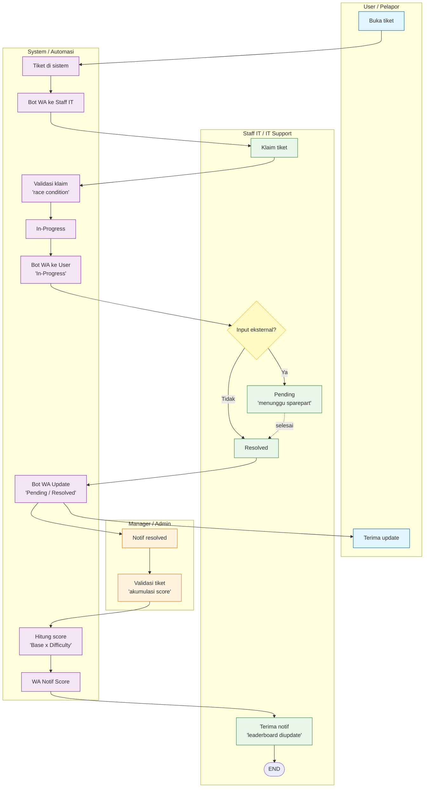

```mermaid
graph TD
    %% Styling Node Berdasarkan Role
    classDef user fill:#e1f5fe,stroke:#01579b,stroke-width:1px;
    classDef staff fill:#e8f5e9,stroke:#2e7d32,stroke-width:1px;
    classDef manager fill:#fff3e0,stroke:#ef6c00,stroke-width:1px;
    classDef system fill:#f3e5f5,stroke:#7b1fa2,stroke-width:1px;
    classDef decision fill:#fff9c4,stroke:#fbc02d,stroke-width:1px;

    %% Kolom 1: User
    subgraph Lane_User [User / Pelapor]
        A[Buka tiket]
        M[Terima update]
    end

    %% Kolom 2: Staff IT
    subgraph Lane_Staff [Staff IT / IT Support]
        D[Klaim tiket]
        H{Input eksternal?}
        J[Pending<br/>'menunggu sparepart']
        K[Resolved]
        Q[Terima notif<br/>'leaderboard diupdate']
        S([END])
    end

    %% Kolom 3: Manager
    subgraph Lane_Manager [Manager / Admin]
        N[Notif resolved]
        O[Validasi tiket<br/>'akumulasi score']
    end

    %% Kolom 4: System
    subgraph Lane_System [System / Automasi]
        B[Tiket di sistem]
        C[Bot WA ke Staff IT]
        E[Validasi klaim<br/>'race condition']
        F[In-Progress]
        G[Bot WA ke User<br/>'In-Progress']
        L[Bot WA Update<br/>'Pending / Resolved']
        P[Hitung score<br/>'Base x Difficulty']
        R[WA Notif Score]
    end

    %% Alur Koneksi (Flow)
    A --> B
    B --> C
    C --> D
    D --> E
    E --> F
    F --> G
    G --> H
    
    H -- Ya --> J
    H -- Tidak --> K
    J -. selesai .-> K
    
    K --> L
    L --> M
    L --> N
    
    N --> O
    O --> P
    P --> R
    R --> Q
    Q --> S

    %% Penerapan Style
    class A,M user;
    class D,J,K,Q staff;
    class H decision;
    class N,O manager;
    class B,C,E,F,G,L,P,R system;
```